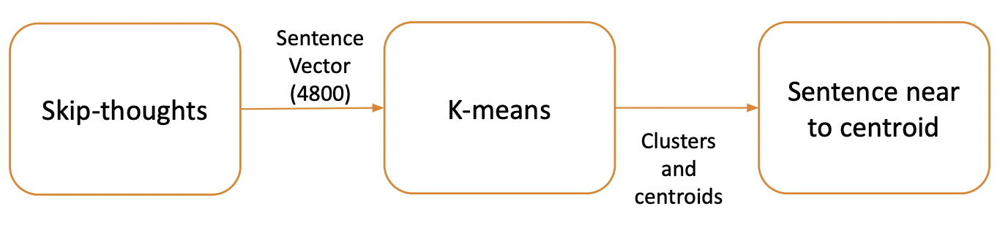
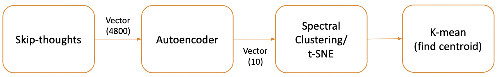
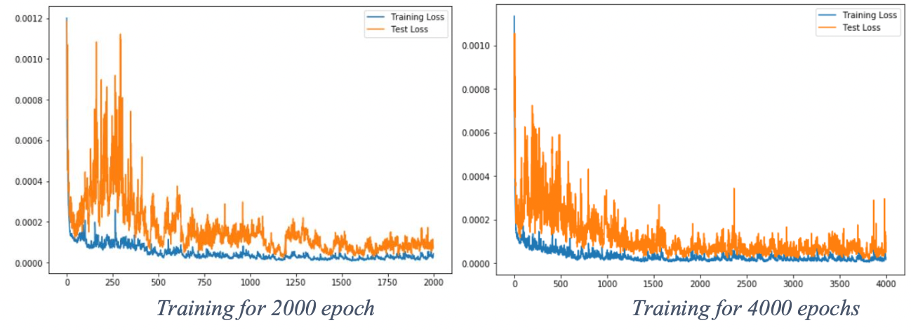

# Adversarial_autoencoder_text_summarizer
## Problem Statement
The advent of public internet access in the turn of the century and all that it encompassed – news articles, blogs, social media platforms, search engines, educational resources, podcasts, had all but one big effect on the total information repository. It transcended the limits of processing information and all that we knew about it. Every day millions, if not hundreds of millions of bytes worth of content is shared across the globe over the internet, most of it being textual data. With this surplus of textual data and no intuitive means of processing all of it, there needs be somewhat of a condensation or for the lack of a better word – compression of the data such that a user intending on educating themselves from an e-learning resource, consuming content or wanting to get a gist of what primarily entails in the data, can do so in an efficient and less time consuming manner. Hence, the need for an implementation of dynamically scaled text summarization techniques.

## Proposed solution:
The above explained problem could be solved by Text summarization via unsupervised machine learning techniques. There are two type of summarization approaches:

**Extractive Summarization:** Summary is formed by taking the important sentences or keywords or phrases from the given text. No new insight is being generated.

**Abstractive Summarization:** Generates syntactically new sentences (paraphrased or in the similar veins) by understanding semantics and grammar of the given text. Basically, how humans come up with summary.

## Dataset Preprocessing
Datset used: CNN Daily Mail Dataset by Hermann et al. (2015) using news articles for Q&A research. The folllowing steps were utilizsed for processing raw data:
   
1. Removing special characters (i.e. $,#,^,*,--,<> etc.) to reduce encountering anomalies during evaluation.
2. Performing decontraction of certain phrases (there’s  - there is).
3. Filtering special embedded tags and aggregating reference summary.
4. Replacing certain filler words (‘New:’, ‘CNN:’, ‘Breaking News:’ etc.), making the topics as objective as possible.

### Embedding Techniques

The following embedding techniques were experimented for numerical representation of the preprocessed text:

**Universal Sentence Encoder:** Forms a vector of 512 dimensions is fomed by utilizing deep averaging network.

**Skip-thoughts:** Forms a vector of 4800 dimensions is formed by finding semantically similar sentences will closer to each other.

## Algorthims Implemented

### Graph Based – Textrank
* The sentences are converted into vectors and then similarity matrix-cosine similarity.
* Graph-sentences act as vertices and similarity scores are edges.
* Page-rank algorithm is used to calculate the score of the sentences

### Clustering Based Text Summarization
Cluster the semantically similar sentences in the given input text.

#### K-Means Clustering Based 
The K-means algorithm is famous algorithm used for clustering the unlabeled data i.e. it is an unsupervised machine learning algorithm. The K here is the input taken by the algorithm, which defines the number of clusters that will be formed. The clusters are formed based of the similarities within data. 

#### Spectral Clustering Based
The spectral clustering is more advanced type of clustering technique which can detect the clusters of complex shapes. The process starts with constructing similarity graph for all the data points and for forming the similarity graph k-nearest neighbor could be used. Further, with the help of eigenvectors of graph Laplacian, the data points are embedded into low dimension space clusters. Finally, the k-mean clustering can be applied to for creating the partitions of the embedded clusters.

The T-SNE (t-distributed Stochastic Neighbor Embedding) method is often used to reduce the dimensionality of data and along with reducing dimensionality, it also preserves a lot of original information

### Improvement by Adversarial Autoencoders
The adversarial autoencoders can be used to produce the latent vectors that forms particular form of distribution and for this method normal distribution is considered because k-means works better with normally distributed data. Further, in-order to perform unsupervised clustering using adversarial autoencoder, one-hot encoded vectors are predicted along with latent vector and both of these vectors fed into decoder to reconstruct the input. The dimension of one-hot encoded vectors will be equal to number of clusters that are required to be formed. Now, clustering is achieved because the similar vectors will produce the similar one-hot encoding vectors. These one-hot encoded vectors verify the clustering of normally distributed latent vector by k-means.

**Encoder and Decoder:** The encoder and decoder are the multilayer feed forward neural networks. The hyperparameters of the network are same as the that of encoder-decoder in method 3. The encoder gives two type of outputs: the latent vector where the output layer has linear function and the one-hot encoded vector where output layer has softmax activation function to generate categorical values. The batch- normalization layer is added to the encoder for normalization. Decoder is reverse setup of the encoder however, the input vector feed to the decoder is the concatenation of the vector of the categorical vector and latent vector produced by the encoder.

**Discriminator:** There are two discriminators here: First discriminator is trained to impose the normal distribution over the latent vectors, and it gives only single output which is 1 when produced latent vector resembles the normal distribution and otherwise gives 0 output. The Second discriminator is trained to identify that if one-hot encoded vectors generated by the encoder follows the rule of one-hot encoding vectors. The discriminators cannot be made too good because then encoder will never be able to fool discriminator and model will never converge and also, they cannot be too weak because then encoder will not be able cluster properly. So, both Discriminator are multilayer feedforward neural networks and comprises of just two layers. The output is just 1 or 0 hence, Binary-Crossentropy loss should work well.

**Training:** Initially, Discriminators are trained and for this training first, encoder is run for one batch of iteration to obtain the latent vectors and one-hot encoded vectors. Along with this, another batch is prepared from the prior normal distribution and random one-hot encoded vector and training of discriminators are done in such way that samples from prior distribution are labeled 1 i.e. real sample and sample produced by encoder to be 0 i.e. fake sample. During the process of training of autoencoder, the losses obtained from both discriminators become part of loss of encoder and weights of the autoencoders are updated accordingly. Therefore, while training autoencoders, it is necessary to set discriminator to trainable = false so that the weights of the discriminator are not being updated. The whole process is repeated in mini batches until the autoencoder is successful in fooling the discriminators.

## Example Summary
**Input:**'Ferguson Police Officer Darren Wilson, who shot and killed teenager Michael Brown on August 9, is in the final stages of negotiations with city officials to resign, according to people close to the talks. Wilson maintains he has not done anything wrong, and the resignation talks have hinged on whether a grand jury returns an indictment against him in the death of Brown, people close to the talks said. Wilson has told associates he would resign as a way to help ease pressure and protect his fellow officers. Wilson has expressed concern about resigning while the grand jury was hearing evidence for fear it would appear, he was admitting fault. Wilson could announce as soon as Friday his plans to resign, the same day a St. Louis County grand jury meets to deliberate and possibly decide on an indictment. The talks could still collapse, these people said. Wilson does not know what the grand jury will do and if they return charges, he could change his mind.’

**Summary by Human:** ‘Wilson has told associates he would resign to protect his fellow officers. Wilson doesn't know what grand jury will do and could change his mind, sources say.’

**Summary by Adversarial Autoencoder:** 'Wilson has told associates he would resign as a way to help ease pressure and protect his fellow officers. Wilson could announce as soon as Friday his plans to resign, the same day a St. Louis County grand jury meets to deliberate and possibly decide on an indictment.’
